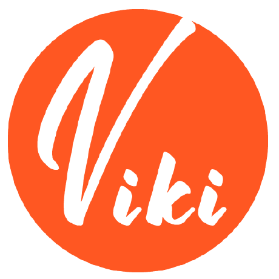

---

# Serverless Lift

Lift is a plugin that leverages the AWS CDK to expand the [Serverless Framework](https://www.serverless.com/) beyond functions.

Deploy production-ready websites, queues, storage buckets, and more with a few lines in `serverless.yml`.

- ⚡️ **For developers** - No AWS knowledge required  
- ⚡️ **Production-ready** - Built by AWS experts, optimized for production  
- ⚡️ **Not invasive** - Integrates with existing projects  
- ⚡️ **No lock-in** - Eject to CloudFormation at any time  

[Why Lift?](docs/comparison.md)

---

## Installation

Lift is a [Serverless Framework plugin](https://www.serverless.com/plugins/), install it in your project:

```bash
serverless plugin install -n serverless-lift
```

> Alternatively, you can install Lift via NPM:  
> `npm install --save-dev serverless-lift`.  
> Then, register the `serverless-lift` plugin in `serverless.yml` (see the example below).

---

## Quick Start

Once installed, start using Lift constructs in `serverless.yml`:

```yaml
service: my-app

provider:
    name: aws

plugins:
    - serverless-lift

functions:
    # Define your serverless functions here...

constructs:
    landing-page:
        type: static-website
        path: 'landing/dist'

    avatars:
        type: storage
```

---

## Constructs

The [AWS CDK](https://docs.aws.amazon.com/cdk/latest/guide/home.html) is extremely powerful but complex and cannot be used in `serverless.yml`. Lift bridges this gap: it brings the best of the CDK into Serverless without requiring you to learn the CDK itself!

Lift provides carefully curated components, or "**constructs**," tailored for serverless applications. These are built with the CDK's best practices and provide a seamless developer experience.

### Example Constructs

- **[Single-page app](docs/single-page-app.md)**: Deploy React, VueJS, or Angular apps.
- **[Static website](docs/static-website.md)**: Deploy static websites.
- **[Storage](docs/storage.md)**: Deploy preconfigured S3 buckets for file storage.
- **[Queue](docs/queue.md)**: Deploy SQS queues and workers for asynchronous processing.
- **[Webhook](docs/webhook.md)**: Deploy webhooks to receive notifications.
- **[Database - DynamoDB Single Table](docs/database-dynamodb-single-table.md)**: Use DynamoDB for Single Table Design.
- **[Server-side website](docs/server-side-website.md)**: Deploy Laravel, Symfony, or other server-side rendered websites.

[See all constructs and documentation.](docs/constructs.md)

---

## Custom Fork Instructions: Using `S3` Branch

To use a custom fork of the `serverless-lift` plugin from the specific branch `S3`, follow these steps:

### Steps:

1. **Uninstall the existing `serverless-lift` plugin**:
   ```bash
   npm uninstall serverless-lift
   ```

2. **Install the custom fork from GitHub**:
   ```bash
   npm install vikivyas/power#S3
   ```

   - Installs the package from the `vikivyas/power` repository.
   - Targets the branch `S3`.

3. **Verify Installation**:
   Check your `package.json` to ensure the plugin is installed correctly:
   ```json
   {
     "dependencies": {
       "serverless-lift": "github:vikivyas/power#S3"
     }
   }
   ```

4. **Update Your Serverless Configuration**:
   No changes to `serverless.yml` are needed unless the custom branch introduces new features or configurations. Your `serverless.yml` should look like this:
   ```yaml
   plugins:
       - serverless-lift
   ```

5. **Test the Setup**:
   Deploy your project to ensure the plugin works as expected:
   ```bash
   serverless deploy
   ```

---

### Notes:
- Ensure the fork is compatible with your setup to avoid dependency conflicts.
- Lock the version in `package.json` to prevent future updates from breaking your setup:
   ```bash
   npm install vikivyas/power#S3 --save-exact
   ```


---

## Ejecting

You can eject from Lift at any time. Since Lift uses CloudFormation under the hood, you can export the template using `serverless lift eject`, and continue with CloudFormation if needed.

---

## Extend Lift Constructs

Each Lift construct includes an `extensions` property for advanced customization. This allows you to override the underlying CloudFormation resources. For example:

```yaml
constructs:
    avatars:
        type: storage
        extensions:
            bucket:
                Properties:
                    AccessControl: PublicRead
```

---

## TypeScript Support

TypeScript users can use `serverless.ts` instead of `serverless.yml`. Lift provides [type definitions to help](docs/serverless-types.md).

---

## Lift is built and maintained with love ❤️ by

<a href="https://www.theodo.fr/" title="Theodo"></a><a href="https://www.serverless.com/" title="Serverless"></a> <a href="https://github.com/aran112000" title="aran112000"></a><a href="https://github.com/vikivyas" title="vikivyas"></a>

---
## Special thanks to contributors:  
[aran112000](https://github.com/aran112000) and [vikivyas](https://github.com/vikivyas).

## AI Contribution Notice

This README file was updated using assistance from ChatGPT, an AI developed by OpenAI.
